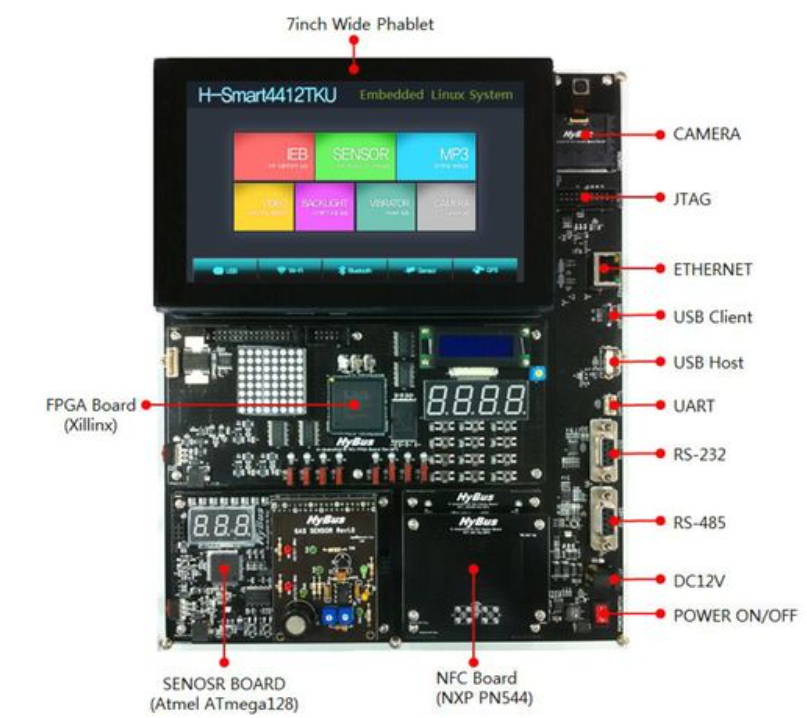

# GALAGA GAME

H-Smart4412TKU로 실행 가능한 갤러그 게임
- H-Smart4412TKU  
</img>

- 참여인원 : 2
- 참고문헌 : 교재의 각 모듈 사용법과 [gettimeofday 함수사용법](https://bywords.tistory.com/entry/CLinux-gettimeofday%EB%A1%9C-%EB%A7%88%EC%9D%B4%ED%81%AC%EB%A1%9C%EC%B4%88-%EB%8B%A8%EC%9C%84-%EC%B8%A1%EC%A0%95%ED%95%98%EA%B8%B0), [sprintf 함수사용법](https://jhnyang.tistory.com/314) 
- [소스코드](src/week4/galaga.c)

* * *

실제로는 깜빡임이 없지만 영상으로만 DotMatrix의 깜빡임이 존재합니다. 

- 1을 누르면 게임 시작  

  오른쪽의 CLCD에서 게임시작버튼 안내문구 출력
  1을 누르면 왼쪽의 DotMatrix에서 게임 출력 

- 게임플레이  

  우주선을 조작하여 게임을 플레이하고 CLCD에 점수 출력

- 게임오버  

  게임오버되면 재시작버튼 안내문구 CLCD에 출력

* * *

## 개발과정
- [1주차](report/week1.md)
- [2주차](report/week2.md)
- [3주차](report/week3.md)
- [4주차](report/week4.md)
- [최종](report/final.md)
