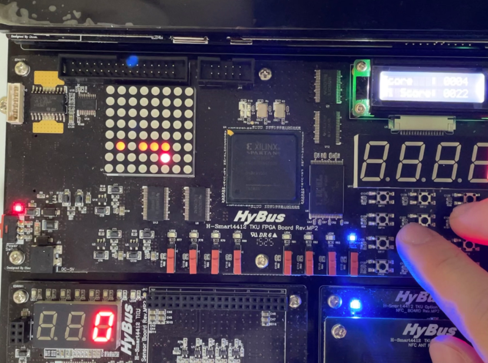
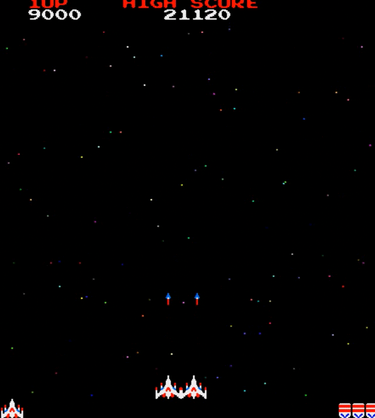
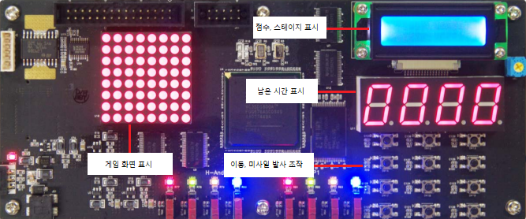
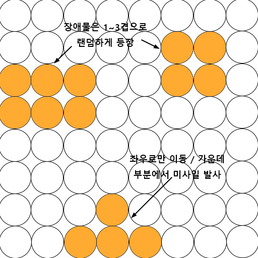

# 22.05.17. 1차 발표

### 프로젝트 계획 발표자 : 장지원

## 주제선정

주제선정에 앞서 사전조사를 진행했다. 임베디드 시스템으로 진행된 프로젝트 대부분이 간단한 게임을 만드는 것이었다.

아래 사진 2개는 사전조사에서 찾은 임베디드 시스템으로 테트리스 게임, 스네이크 게임을 구현한 사진이다.

 

사전조사한 프로젝트 처럼 장치의 특성상 복잡한 게임보다는 간단한 종류의 게임을 만드는 것이 좋다 생각해서 위 2개의 게임과 비슷한 고전게임인 __갤러그 게임__ 을 구현하기로 했다.

*↑ 구현 목표인 갤러그 게임*

 

## 세부 구상

### 우주선

* 사용자가 직접 조작
* 좌우로만 이동 가능
* 미사일 발사로 장애물 파괴

### 장애물

* 위치 및 두께가 랜덤으로 등장
* 맨 위에서부터 일직선으로 내려옴(좌우 이동x)
* 우주선이 발사한 미사일에 맞으면 파괴

### 게임 운영

* 우주선이 장애물에 부딪히면 게임 오버
* 장애물을 부술때마다 점수 증가
* 스테이지 별 시간이 존재
* 해당 시간동안 생존시 다음 스테이지로 넘어감

### 사용 장치

* Dot Matrix - 게임 화면 표시
* CLCD - 점수&스테이지 표시
* 7 Segment - 스테이지 남은 시간 표시
* Tact Switch - 이동&미사일 발사 조작

### Dot Matrix 화면 구상

 

## 차별점

앞서 사전조사한 테트리스 게임과 스네이크 게임을 포함해서 대부분 게임 프로젝트들은 하나의 난이도로 반복해서 진행되는 구조이다.

하지만 우리 조는 스테이지 방식을 이용해서 게임이 진행될수록 난이도가 점점 상승하도록 만들어 일관된 난이도로 진행되는 게임보다 재미를 높혔다.

* 스테이지 클리어시 난이도 상승
* 난이도 상승요인
  * 넓은 장애물 등장 확률 증가
  * 두꺼운 장애물 등장 확률 증가
  * 장애물이 내려오는 속도
  * 장애물 생성 주기

## 참고문헌
[Snake 게임](https://github.com/jinwoo1225/SnakeGameWithSmart4412)

[테트리스 게임](https://github.com/raekim/embedded_tetris)
